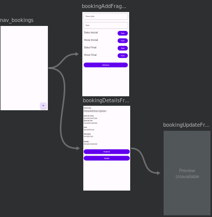

# trabalhoPDM_6160_9710 - LESI - IPCA

Projeto desenvolvido para a disciplina de Progamação de Dispositivos Móveis.

Esta disciplina faz parte do terceiro ano curricular da Licenciatura em Engenharia de Sistemas Informáticos.

## Colaboradores

Este trabalho contou com a colaboração dos seguintes alunos:

- 6160 - Renato Dantas
- 9710 - Fábio Mota

## Introdução

Este trabalho foi desenvolvido para a disciplina de Programação de Dispositivos Móveis, e tem como objetivo sedimentar os conceitos aprendidos durante o semestre letivo.

Com base nos conhecimentos adquiridos, iremos desenvolver uma aplicação móvel em Kotlin, utilizando o Android Studio, que suporte as funções de CRUD e autenticação, através da interação com uma API externa, alojada num servidor público.

## Contextualização do Problema

A aplicação desenvolvida servirá de interface gráfica da API de gestão desenvolvida para a disciplina de Sistemas Embebidos e em Tempo Real.

A API faz a gestão de marcação de pontos e autorização de acesso a diversas áreas de uma empresa, assim como a reserva de salas, através de um sistema embebido e em tempo real.

Como tal, a aplicação móvel deverá de suportar as seguintes funcionalidades:

- Login e Logout de utilizador
- Reconhecer o utilizador que está logado
- Mostrar as informações relativas ao utilizador
- Listar as Áreas, Marcações de Pontos e Reservas
- Adicionar, Editar ou Apagar uma Reserva

Outras adições que sejam necessárias para o bom funcionamento da aplicação ou que adicionem valor.

## Exemplo de Operações

Neste capitulo mostraremos alguns exemplos de operações que a App suporta.

### Login Activity

Nesta atividade é feito o Login na aplicação através de username e password.

Após verificação da existencia dos mesmo é emitido um token JWT do qual é extraido as Claims importantes e guardadas num Shared Preferences

```kotlin
override fun onCreate(savedInstanceState: Bundle?) {
    super.onCreate(savedInstanceState)

    binding = ActivityLoginBinding.inflate(layoutInflater)
    setContentView(binding.root)

    binding.loginBtn.setOnClickListener {
        val username = binding.loginUsername.text.toString()
        val password = binding.loginPassword.text.toString()

        val json = JSONObject()
        json.put("username", username)
        json.put("password", password)

        RootBackend.login(baseContext, lifecycleScope, json) {
            if (it) startActivity(Intent(this@LoginActivity, MainActivity::class.java))
            else Toast.makeText(baseContext, "Autenticação Falhada", Toast.LENGTH_SHORT).show()
        }
    }
}
```

### Navegação entre os Fragementos das Reservas (Bookings)

Na seguinte imagem explica a navegação no item do menu Reservas.



A vista principal das Reservas terá a lista dos bookings e tem duas alternativas seguintes:

- **bookingAddFragment** para adicionar um novo booking onde tem duas textView para o utilizador preencher a descrição e a sala;
- **bookingDetailsFragment** que lista os detalhes do booking e onde o utilizador pode escolher navegar para a vista de atuzaliação ou então apagar a reserva;

### BookingsAdapter

Durante o projeto foram utilizados diversos Adaptadores Personalizados para mostrar informações nas diversas listas.

Foi utilizado o BaseAdapter para retornar os bookings e os respectivos campos: UserName, Description e StartDate, através da View row_booking.

```kotlin
inner class BookingsAdapter : BaseAdapter() {
    override fun getCount(): Int {
        return bookings.size
    }

    override fun getItem(i: Int): Any {
        return bookings[i]
    }

    override fun getItemId(p0: Int): Long {
        return 0L
    }

    override fun getView(i: Int, view: View?, viewGroup: ViewGroup?): View {
        val rowBooking = layoutInflater.inflate(R.layout.row_booking, viewGroup, false)
        val userName = rowBooking.findViewById<TextView>(R.id.rwBookingUserName)
        val description = rowBooking.findViewById<TextView>(R.id.rwBookingDescription)
        val startDate = rowBooking.findViewById<TextView>(R.id.rwBookingStartDate)

        val booking = bookings[i]
        userName.text = booking.userName
        description.text = booking.description
        startDate.text = booking.startDate?.parseDateFull()

        rowBooking.setOnClickListener {
            findNavController().navigate(
                R.id.action_nav_bookings_to_bookingDetailsFragment,
                Bundle().apply {
                    putInt(BookingDetailsFragment.BOOKING_ID, booking.id!!)
                }
            )
        }

        return rowBooking
    }
}
```

### bookingAddFragment

Com o binding adicionamos a descrição e a sala inseridos na textView.

```kotlin
binding.bookingAddDescription.editText?.doOnTextChanged { inputText, _, _, _ ->
    description = inputText.toString()
}

binding.bookingAddRoom.editText?.doOnTextChanged { inputText, _, _, _ ->
    room = inputText.toString().toInt()
}
```

Para a data e hora foi implementado o MaterialDatePicker e MaterialTimePicker.

```kotlin
binding.bookingAddStartDateBtn.setOnClickListener {
    val datePicker =
        MaterialDatePicker.Builder.datePicker()
            .setTitleText("Selecione a Data do Inicio")
            .setSelection(MaterialDatePicker.todayInUtcMilliseconds())
            .build()
    datePicker.show(this.requireActivity().supportFragmentManager, "tag")
    datePicker.addOnPositiveButtonClickListener {
        startDate = datePicker.selection?.parseLongToDateString()
        binding.bookingAddStartDate.text = startDate
    }
}

binding.bookingAddStartTimeBtn.setOnClickListener {
    val timePicker = MaterialTimePicker
        .Builder()
        .setTimeFormat(TimeFormat.CLOCK_24H)
        .setHour(12)
        .setMinute(10)
        .setTitleText("Selecione a Hora Inicial")
        .build()
    timePicker.show(this.requireActivity().supportFragmentManager, "tag")
    timePicker.addOnPositiveButtonClickListener {
        val hour = timePicker.hour.toString()
        val minute = timePicker.minute.toString()
        startTime = "${hour}:${minute}"
        binding.bookingAddStartTime.text = startTime
    }
}
```

Exceção de erro ao adicionar booking caso os campos estejam vazios.

```kotlin
if (description == null || room == null || startDate == null || startTime == null || finalDate == null || finalTime == null) {
    Toast.makeText(context, "Campos Obrigatórios Vazios", Toast.LENGTH_SHORT).show()
    return@setOnClickListener
}
```

Coloca dados num objecto JSON e envia a informação para a API.

```kotlin
val dateTimeStart = parseDateTimeISO(startDate!!, startTime!!)
val dateTimeFinal = parseDateTimeISO(finalDate!!, finalTime!!)

val json = JSONObject()
json.put("description", description)
json.put("room", room)
json.put("start", dateTimeStart)
json.put("final", dateTimeFinal)

val context = activity?.baseContext
if (context != null) {
    BookingsBackend.postBooking(context, lifecycleScope, json) {
        if (it) parentFragmentManager.popBackStack()
        else Toast.makeText(context, "Criação Falhada", Toast.LENGTH_SHORT).show()
    }
}
```

### bookingDetailsFragment

É feita uma chamada à API, para retirar os dados necessários para construir o fragmento dos detalhes.

```kotlin
val context = activity?.baseContext
if (context != null) {
    BookingsBackend.getBooking(context, lifecycleScope, bookingID!!) {
        binding.BookingDetailsDescription.text = it.description
        binding.BookingDetailsStartDate.text = it.startDate!!.parseDateFull()
        binding.BookingDetailsFinalDate.text = it.finalDate!!.parseDateFull()
        binding.BookingDetailsRoom.text = it.roomName
        binding.BookingDetailsUser.text = it.userName
        binding.BookingDetailsValidated.text = if (it.validated == true) "Está validado" else "Não está validado"
    }
}
```

No final do fragmento é adicionado 2 botões para efetuar uma atualização do booking ou a apagar o respetivo booking.

```kotlin
binding.BookingDetailsBtnUpdate.setOnClickListener {
    findNavController().navigate(
        R.id.action_bookingDetailsFragment_to_bookingUpdateFragment,
        Bundle().apply {
            putInt(BookingDetailsFragment.BOOKING_ID, bookingID!!)
        }
    )
}

binding.BookingDetailsBtnDelete.setOnClickListener {
    if (context != null) {
        BookingsBackend.deleteBooking(context, lifecycleScope, bookingID!!) {
            if (it) parentFragmentManager.popBackStack()
            else Toast.makeText(context, "Destruição Falhada", Toast.LENGTH_SHORT).show()
        }
    }
}
```

## Conclusão

Com a execução deste trabalho, acreditamos ter concluído com sucesso os objetivos que nos propusemos a concretizar.

Através de alguma investigação e pesquisa, foi possível construir uma aplicação fiável e segura, utilizando também o material e a matéria lecionada durante o semestre letivo.
